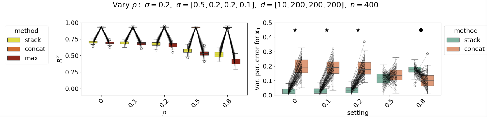
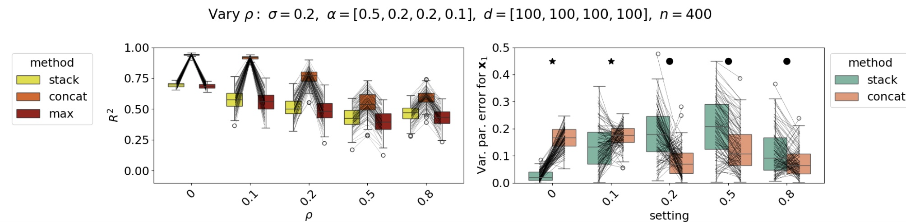
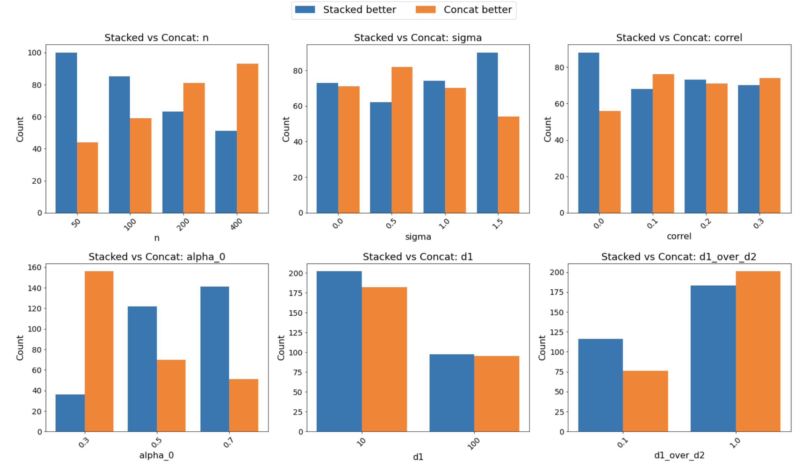
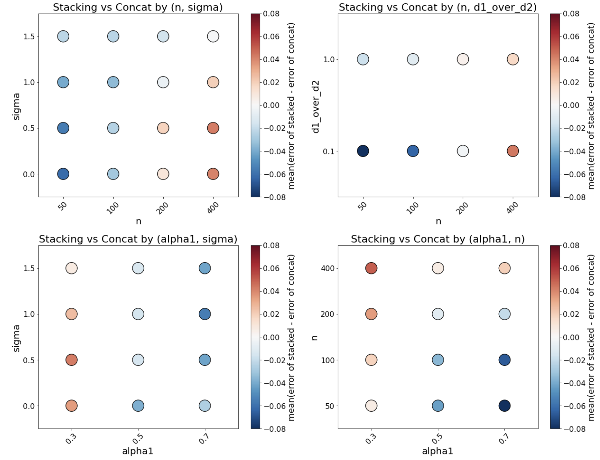

## Correction and Extended Simulation Study

### Correction to the Original Paper

In the original paper, we stated that the simulation experiment used a **correlation of 0.2 between the feature spaces**. However, due to a bug in our simulation code (which is now fixed), the results in the published article actually correspond to a **correlation of 0**.

We now provide **two corrected examples** below generated using different correlations levels.

---

### New Examples with Correlated Feature Spaces

#### **Example 1**

#### **Example 2**

As can be seen, in some parameter settings **stacking outperforms concatenation**, while in others **concatenation performs better**.  

As we emphasized in the paper, *these simulations cannot be taken as proof of either model's superiority*: there are infinitely many simulation configurations and the behaviors of stacking vs. concatenation depend heavily on the structure of the data.

To deepen our understanding of this specific simulation setup, we performed a substantially more **comprehensive sweep** of parameters.

---

## Extended Simulation Sweep

Below we report results from a broad grid of simulation settings (576 in total).  
For each configuration, we generate **100 independent datasets** using the same simulation framework as in the original study.

This sweep varies the following parameters:

- **Number of samples (n)** 50, 100, 200, 400
- **Dimensions of feature spaces (d1,d2,d3,d4)**: [10, 10, 10, 10], [10, 100, 100, 100],  [100, 100, 100, 100]
- **Feature importance (alpha)**: [0.3, 0.3, 0.3, 0.1], [0.5, 0.2, 0.2, 0.1], [0.7, 0.1, 0.1, 0.1]
- **Noise (sigma)**: 0, 0.5, 1, 1.5
- **Feature correlation (correl)**: = [0, 0.1, 0.2, 0.3]
  
Together, this produces a total of 576 total simulation settings. Each setting is run with 100 simulated datasets.

### Results
Below we group the simulation results by parameter families to understand which factors most strongly influence whether stacking or concatenation performs better.

In the figure below, we focus on one parameter at a time, and count the number of simulation settings (over all other parameters) for which stacking has reliably lower estimation error than concatenation, and the ones for which concatenation has reliably lower estimation error than stacking (similar to the right part of the two plots above, we count the number of stars and filled circles).

We see that smaller sample size n, higher noise sigma, low correlation, higher values of alpha1 and lower values of d1/d2 lead to better performance of stacking across the different settings of the other parameters.

Instead of counting the number of experiment where one method is reliably better than the other, we compute the average error across experiments and settings, picking pairs of parameters at at time:

This visualization of the difference in average error highlights a relationship between n, sigma and alpha1. Small n and low sigma lead to concatenation performing better. Large alpha1 leads to stacking being better, but not at high n.

### Conclusion
Across this **specific** simulation grid, we observe the following patterns:
- Stacking can have lower error in lower sample sizes (n).
- Stacking can have lower error in higher noise settings (sigma).
- Stacking can have lower error when d1 is smaller than the other feature sizes.
- Stacking can have lower error when alpha1 is large.

Importantly, when we compare these findings to the real-data experiment in our paper:
- Our dataset has 7 × 1024 = 7168 total features, which is on the same order as the ∼8000 training samples.
- fMRI data has considerable noise.
- Potentially, there could be a preference for a feature space (one of the alphas is large). 

Thus, the empirical conditions of the real dataset (and of data from experiments similar to the one we use) appear to correspond to simulation settings under which stacking tends to have an advantage, suggesting that stacking could be useful for building fMRI encoding models in naturalistic experiments. As we mentioned in the paper, even in the event where the experimenter thinks that concatenation might be better, they can include an additional feature space with the concatenated features. 
